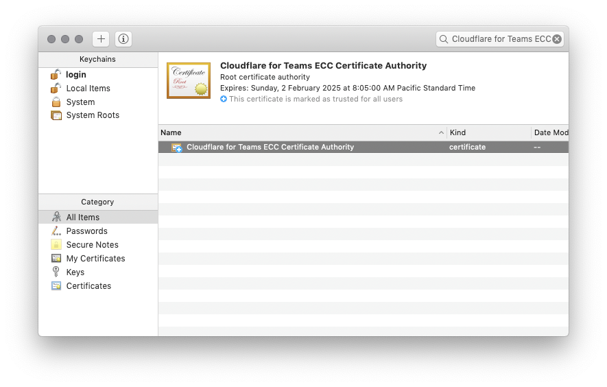

# Uninstall

### macOS

#### Cloudflare WARP

1. Close Cloudflare WARP
   1. Select Cloudflare WARP from your menu bar (top right).
   2. Select the Gear Icon
   3. Close Cloudflare WARP by selecting "Quit".
2. Open **Finder**.
3. Select **Applications**.
4. Drag **Cloudflare WARP** to your Trash icon in the Dock.

#### Cloudflare for Teams Root CA

1. Open Keychain Access.
   The fastest way to do this is open Spotlight (Command + Space) and type: _Keychain Access_.
2. Search "_Cloudflare for Teams ECC Certificate Authority_" in search input (top right).
3. Right-click _Cloudflare for Teams ECC Certificate Authority_ and select **Delete "Cloudflare for Teams ECC Certificate Authority"**.

### Windows

Both the **Cloudflare for Teams Root CA** and the **Cloudflare WARP** client may be uninstalled in Windows 10 settings:

#### Cloudflare WARP

1. Close Cloudflare WARP
   1. Select _Cloudflare WARP_ from your task bar (bottom right).
   2. Select the Gear Icon.
   3. Close Cloudflare WARP by selecting **Quit**.
2. Open the _Start_ menu.
3. Type "_Add and remove programs_" and press enter.
4. Search "_Cloudflare_" in the Apps & Features list.
5. Uninstall Cloudflare WARP.

#### Cloudflare for Teams Root CA

1. Open the _Start_ menu,
1. Type "_MMC_" into the run box. This will launch Microsoft Management Console
1. Select _File_, then _Add/Remove Snap-In_
1. Select the "_Cloudflare for Teams ECC Certificate Authority_" root certificate.
1. In the right click context menu, click _Delete_.
1. Click _Yes_.
