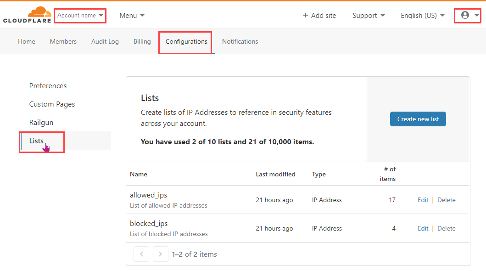

# Use Rules Lists

Rules Lists allow you to create a group of IP addresses and refer to them collectively, by name, in your firewall rule expressions. For an introduction, see [*Rules Lists*](/firewall/cf-firewall-rules/rules-lists/).

## Access the Lists interface

Because Rules Lists are stored at the account level, the **Lists** interface is located in your account **Configurations** page, not the Cloudflare dashboard.

To access the **Lists** interface, follow these steps:

1.  Log in to your Cloudflare account.
2.  Click on your account name or profile picture in the header and select **Account Home**.
3.  Click the **Configurations** tab.
4.  Select **Lists**.

The **Lists** user interface displays.

## Create your first Rules List

Creating a Rules Lists involves two steps:

1.  [Create a Firewall Rules list](/firewall/cf-dashboard/rules-lists/manage-lists/#create-a-firewall-rules-list).
2.  [Add IP addresses to the list](/firewall/cf-dashboard/rules-lists/manage-items/#add-items-to-a-list).

## Use Rules Lists in expressions

To use Rules Lists in the Cloudflare dashboard, see [*Use lists in expressions*](/firewall/cf-dashboard/rules-lists/use-lists-in-expressions/).
