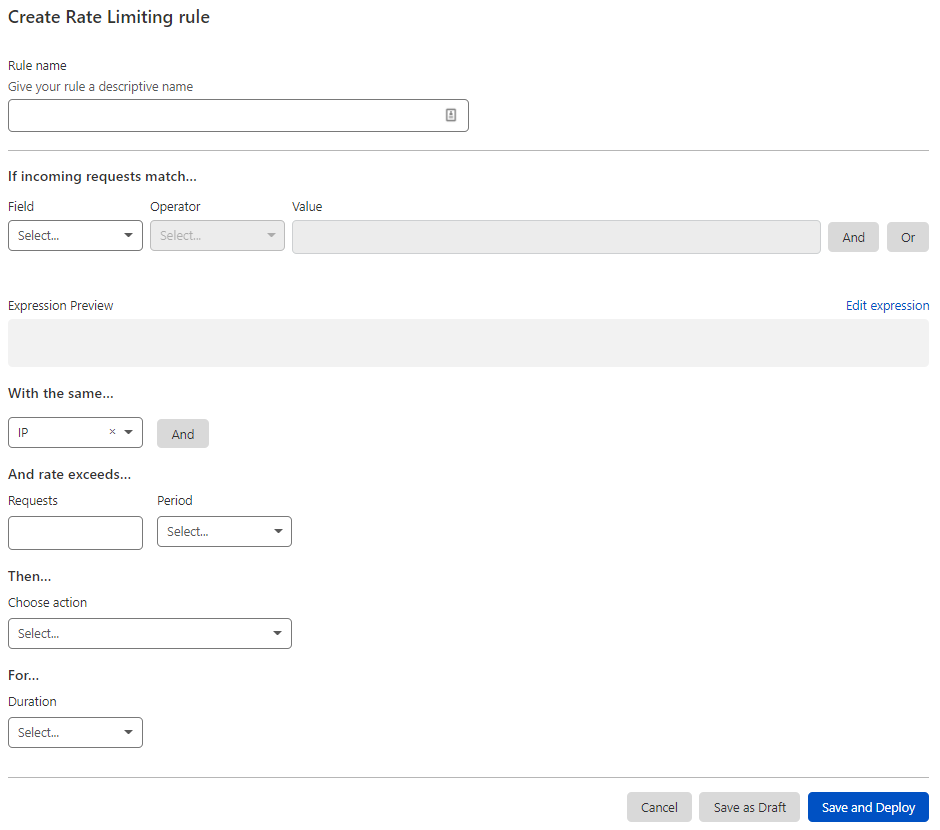

# Create Rate Limiting rules in the dashboard


This feature is only available for selected customers on an Enterprise plan.


Create Rate Limiting rules under the **Custom Rules** tab in the **Firewall** app.

## Create a Rate Limiting rule

To create a new Rate Limiting rule:

1.  Log in to the Cloudflare dashboard.

2.  Select the **Websites** tab and choose the site for which you want to create a rule.

3.  Navigate to **Firewall** > **Custom Rules**.

4.  Click **Create Custom rule** > **Rate limiting rule**.

5.  In the page that displays, enter a descriptive name for the rule in **Rule name**.

    

6.  Under **If incoming requests match**, use the **Field** drop-down list to choose an HTTP property. For each request, the value of the property you choose for **Field** is compared to the value you specify for **Value** using the operator selected in **Operator**.

7.  Under **With the same**, add one or more characteristics that will define the request counters for rate limiting purposes. Each value combination will have its own counter to determine the request rate. Check [Determining the request rate](/waf/custom-rules/rate-limiting/request-rate/) for more information.

8.  Under **And rate exceeds**, define the rate limit and the time period to consider when determining the request rate.

9.  Select the rule action from the **Choose action** drop-down list. For example, selecting _Block_ tells Cloudflare to refuse requests in the conditions you specified when the request limit is reached.

10. Under **For**, select the mitigation timeout. This is the time period during which Cloudflare applies the select action once the request rate is reached.

11. To save and deploy your rule, click **Save and Deploy**. If you are not ready to deploy your rule, click **Save as Draft**.
